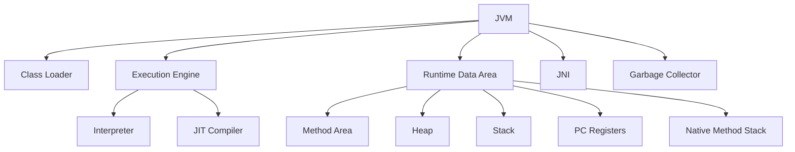
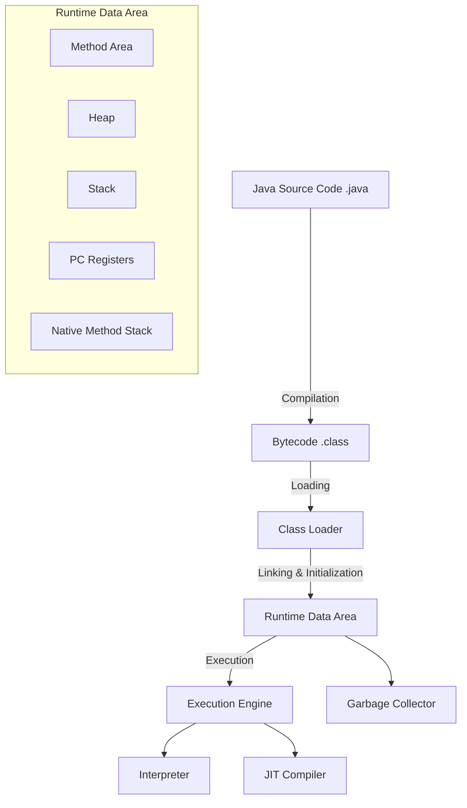

# JAVA - JVM
Java Virtual Machine
### JVM이란?
JVM은 Java 프로그램을 실행하기 위한 가상 컴퓨터임. Java 프로그램이 플랫폼 독립적이 될 수 있게 해주는 핵심 요소

> JVM은 Java 바이트코드를 기계어로 변환하여 실행함.

### JVM의 주요 구성 요소
1. **Class Loader**:
    - Java 클래스 파일을 로드하고 메모리에 배치하는 역할을 함.
    - 클래스의 로딩, 링크, 초기화 작업을 수행함.
2. **Execution Engine**:
    - 실제로 바이트코드를 실행하는 컴포넌트임.
    - 인터프리터와 JIT (Just-In-Time) 컴파일러로 구성됨.
3. **Runtime Data Area**:
    - JVM이 실행될 때 사용되는 메모리 영역임.
    - 여러 영역으로 나뉘며, 각각의 역할이 있음.
        - **Method Area**: 클래스 구조와 메서드 데이터 저장
        - **Heap**: 객체와 배열 저장
        - **Stack**: 메서드 호출과 로컬 변수 저장
        - **PC Registers**: 현재 실행 중인 명령어 주소 저장
        - **Native Method Stack**: 네이티브 메서드 호출을 위한 스택
4. **Native Method Interface (JNI)**:
    - Java 코드에서 네이티브 코드를 호출할 수 있게 해주는 인터페이스임.
5. **Garbage Collector**:
    - 사용하지 않는 객체를 자동으로 메모리에서 해제하는 역할을 함.

### 작동방식
- 소스 코드 컴파일
    - Java 소스 파일 (`.java`)이 컴파일러 (`javac`)에 의해 바이트코드 (`.class`)로 변환됨.
- 클래스 로딩
    - Class Loader가 클래스 파일을 로드하고 메모리에 배치함.
- 링킹 및 초기화
    - 클래스 파일을 링크하여 참조를 해결하고 초기화 작업을 수행함.
- 실행
    - Execution Engine이 바이트코드를 실행함.
    - 인터프리터 방식과 JIT 컴파일 방식을 통해 실행 속도를 최적화함.
- 런타임 데이터 관리
    - Runtime Data Area에서 메모리 관리와 데이터 저장이 이루어짐.
    - Garbage Collector가 사용되지 않는 객체를 메모리에서 해제함.

