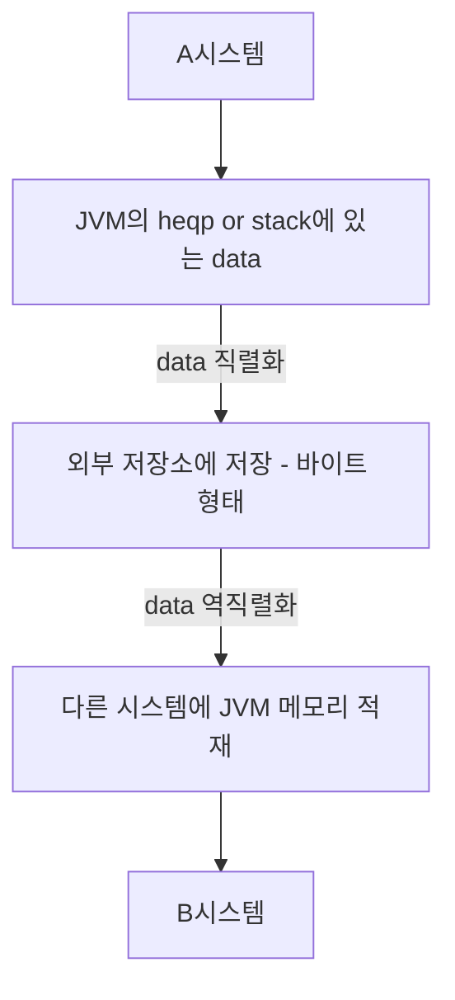
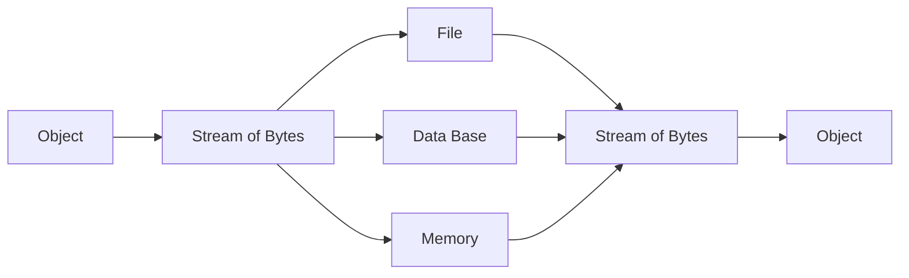

# JAVA - Serialization
## 자바의 직렬화
`직렬화`란 자바언어에서 사용되는 Object or Data를 다른 컴퓨터의 자바 시스템에서도 사용할수 있도록 `바이트 스트림 형태로 연속적인 데이터로 변환하는 포맷 변환 기술`

그 반대 개념이 `역직렬화` `바이트로 변환된 데이터를 자바시스템의 Object or Data로 변환하는 기술`

시스템적으로 정리하면

## 데이터 직렬화 포맷
- CSV, XML, JSON 형태의 직렬화
    - 사람이 읽을수 있음
    - 저장공간에 효율성 낮음, 파싱하는데 시간이 오래 걸림
- Binary 직렬화
    - 사람이 읽을수 없음
    - 저장공간에 효율성 높음, 파싱하는데 시간이 빠름
- JAVA 직렬화
    - 자바 시스템에서 매우 편함
    - 구현시 고려할게 많음 -> 어려움

## Reference & Additional Resources
- https://rlaehddnd0422.tistory.com/218
- https://inpa.tistory.com/entry/JAVA-%E2%98%95-%EC%A7%81%EB%A0%AC%ED%99%94Serializable-%EC%99%84%EB%B2%BD-%EB%A7%88%EC%8A%A4%ED%84%B0%ED%95%98%EA%B8%B0
- https://www.youtube.com/watch?v=3iypR-1Glm0