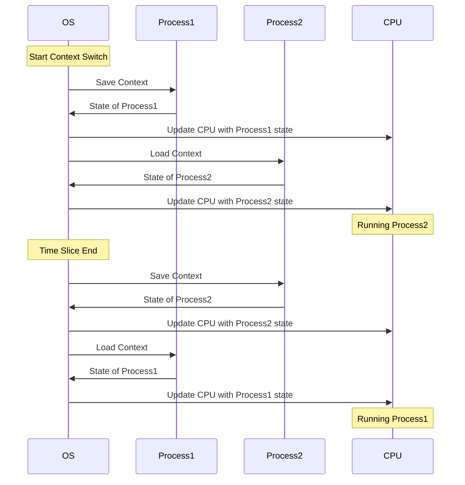

# 운영체제(OS) 컨텍스트 스위칭
## 컨텍스트 스위칭이란?
>여러개의 프로세스가 실행되고 있을 때 기존에 실행되던 프로세스를 중단하고 다른 프로세스를 실행하는 것

즉, CPU에 실행할 프로세스/스레드를 교체하는 기술

### Context?

context: CPU가 해당 프로세스를 실행하면서 가지는 정보
이러한 정보들은 프로세스의 PCB에 저장되고 스위칭이 발생하면 이어받아서 작업을하게된다.

1. 컨텍스트 전환 시작: 운영 체제(OS)가 컨텍스트 전환 프로세스를 시작합니다.
2. Process1의 컨텍스트 저장: OS는 Process1의 컨텍스트를 저장합니다. 여기에는 프로그램 카운터, CPU 레지스터 및 기타 필요한 상태와 같은 현재 상태를 저장하는 것이 포함됩니다.
3. Process1 상태로 CPU 업데이트: OS는 저장된 Process1 상태로 CPU를 업데이트하여 상태가 올바르게 저장되도록 합니다.
4. Process2의 컨텍스트 로드: 그런 다음 OS는 Process2의 저장된 상태를 CPU로 복원하는 과정을 포함하는 Process2의 컨텍스트를 로드합니다.
5. Process2 상태로 CPU 업데이트: CPU는 Process2의 상태로 업데이트되어 중단된 부분부터 Process2를 계속 실행할 수 있습니다.
6. Process2 실행 중: 이제 CPU가 Process2를 실행 중입니다.
7. 타임 슬라이스 종료: OS는 Process2의 타임 슬라이스가 끝났다고 결정하여 다시 전환할 시간임을 나타냅니다.
8. Process2의 컨텍스트 저장: OS는 Process2의 현재 컨텍스트를 저장합니다.
9. Process2 상태로 CPU 업데이트: OS는 Process2와 관련된 CPU 상태가 올바르게 저장되도록 보장합니다.
10. Process1의 컨텍스트 로드: OS는 Process1의 저장된 컨텍스트를 CPU로 로드합니다.
11. Process1 상태로 CPU 업데이트: CPU가 Process1의 상태로 업데이트되어 이전에 중단된 위치에서 실행을 계속할 수 있습니다.
12. Process1 실행: CPU가 Process1 실행을 재개합니다.