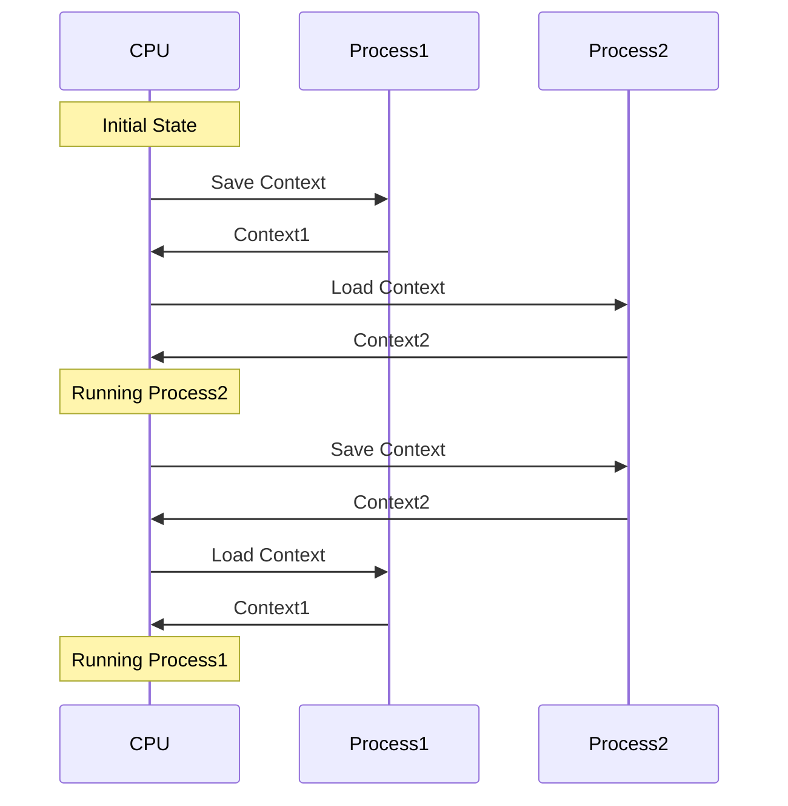

# 운영체제(OS) 컨텍스트 스위칭
## 컨텍스트 스위칭이란?
>여러개의 프로세스가 실행되고 있을 때 기존에 실행되던 프로세스를 중단하고 다른 프로세스를 실행하는 것

즉, CPU에 실행할 프로세스/스레드를 교체하는 기술

### Context?

context: CPU가 해당 프로세스를 실행하면서 가지는 정보
이러한 정보들은 프로세스의 PCB에 저장되고 스위칭이 발생하면 이어받아서 작업을하게된다.

초기 상태: CPU가 초기 상태에서 시작됩니다.
Process1의 컨텍스트 저장: CPU는 Process1의 컨텍스트(상태)를 저장합니다. 여기에는 프로그램 카운터, 레지스터 및 기타 필요한 상태가 포함됩니다.
Process2의 컨텍스트 로드: 그런 다음 CPU는 이전에 저장된 Process2의 컨텍스트를 로드합니다.
Process2 실행 중: 이제 CPU가 Process2를 실행 중입니다.
Process2의 컨텍스트 저장: 어느 시점에서 CPU가 다시 전환해야 하므로 Process2의 현재 상태를 저장합니다.
Process1의 컨텍스트 로드: CPU는 Process1의 저장된 상태를 로드합니다.
프로세스1 실행 중: CPU는 중단된 부분부터 프로세스1의 실행을 재개합니다.
