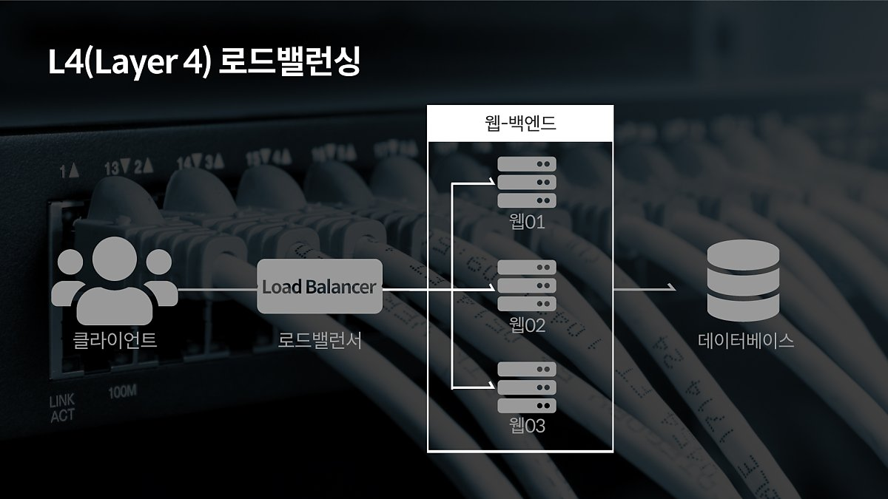

### **로드밸런싱**

---

서버, 데이터베이스 등의 중앙처리장치를 여러 개 두고 트래픽을 분산

→ 부하를 최적화하는 컴퓨터 네트워크 기술

- 스케일 업
    - 하드웨어 성능을 업그레이드, 수직적 확장
    - 관리가 필요한 하드웨어의 개수는 그대로 - 유지 보수가 간편
    - 하드웨어의 성능 업그레이드는 많은 비용이 필요, 성능이 아무리 높아도 한 번 문제가 생기면 영향이 크다
- 스케일 아웃
    - 서버, 저장소 등을 여러대 증설하는 방식, 수평적 확장
    - 수직적 확장에 비해 비용이 저렴하며 돌발상황 시 유연하게 대처 가능
    - 증설함에 따라 관리가 어려워지는 단점이 존재 - **로드 밸런서 사용**
- 기본 기능
    - Health check - 서버들에 대해 주기적인 기능 검사를 통해 장애 여부 파악 및 리디렉션
        - L3 체크: 서버가 통신이 가능한 상태인지 확인, ICMP(ping)을 보내 서버가 살아있는지만 확인하는 간단한 체크
        - L4 체크: TCP의 특성을 사용해 서비스 포트가 사용 가능한지 확인
        - L7 체크: 실제 애플리케이션 콘텐츠를 주고 받아 정상적으로 기능하는 중인지 확인, 문자열만 확인하기 때문에 특정 문자열이 에러코드에 들어가있어도 정상으로 판단할 수 있기 때문에 일반적으로 사용되는 문자열이 아닌 것으로 설정하는 것이 좋다
    - 터널링 - 데이터 스트림을 가상의 파이프를 통해 전달시키는 기술, 연결된 상호간에만 캡슐화된 패킷을 구별 및 해제 가능
    - NAT: 사설 IP 주소와 외부의 공인 IP주소 간의 변환, 여러 호스트가 하나의 공인 IP를 통해 접속하게 할 수 있다.
    - DSR: 서버의 요청 처리 결과를 로드밸런서를 통하지 않고 직접 클라이언트를 찾아가게 하는 방식, 로드 밸런서의 부하를 줄일 수 있다.

**로드 밸런싱의 이점**

---

- 가용성 유지
    - 애플리케이션이 서버 장애나 유지 보수 등의 이유로 인해 중지되는 시간을 최소화
    - 로드 밸런서를 통해 서버 상태를 감시하고 적절한 리닥이렌션을 통해 내결함성 강화
    - 가동 중지 없이 문제가 발생한 서버의 유비 보수가 가능
- 높은 확장성
    - 필요에 따라 서버를 추가로 증설하거나 감소 시킬 수 있다.
    - 오토 스케일링을 통해 서버의 수를 동적으로 조절이 가능
- 보안
    - 로드 밸런서는 비정상적 트래픽을 사전에 감지하고 차단이 가능
    - SSL 암호화, 방화벽 등의 보안 기능을 탑재하여 DDoS 공격 등에 대처가 가능
    - 외부에 노출시킬 IP를 관리하여 악의적인 공격에 대한 위험을 최소화 할 수 있다.
- 성능
    - 클라이언트와 더 가까운 서버로 리다이렉션, 지연 시간 단축이 가능
    - 서버 간의 부하를 적절하게 배포하여 성능 최적화

**로드 밸런싱 알고리즘**

---

- 라운드 로빈
    - 서버로 들어온 요청을 순서대로 돌아가며 각 서버에 배정하는 방식
    - 서버들이 모두 동일한 스펙을 가지고 있고 각 요청이 빠르게 처리될 수 있는 경우, 세션의 유지가 오래 지속되지 않는 경우 유효한 방식
- 가중 라운드 로빈
    - 서버마다 가중치를 책정 (서버의 성능, 처리 능력), 가중치가 높은 서버에 트래픽을 우선적으로 배정
    - 서버마다 성능이 다를 경우 주로 사용되는 방식
- IP 해시
    - 사용자의 IP를 해싱하여 정해진 서버하고만 세션을 형성할 수 있도록 구성
    - 특정 IP나 포트의 접속[Sanghyun.md](Sanghyun.md)량이 다른 곳보다 많을 경우 사용하는 방식
- 최소 연결
    - 로드 밸런서가 서버의 상태를 확인하고 가장 연결이 적은 서버로 트래픽을 처리하는 방식
    - 이 방법은 모든 서버가 동일한 처리 능력을 가지고 있다고 가정하고, 각 세션들의 종료 시간이 제각각일 때 사용하는 것이 좋다.
- 최소 응답 시간
    - 서버의 현재 연결 상태, 응답 시간을 모두 고려하여 가장 짧은 응답 시간을 보내는 서버로 트래픽 연결
    - 모든 사용자에게 최적의 속도로 서비스를 제공할 수 있게 해줌

**로드 밸런싱 종류**

---

**가장 많이 활용되는 로드 밸런싱의 종류는 L4와 L7 로드 밸런싱**

OSI 7계층(Layer) 중 4계층과 7계층 프로토콜의 헤더를 부하 분산에 사용하기 때문에 L4와 L7로 나뉨

[https://m.post.naver.com/viewer/postView.naver?volumeNo=27046347&memberNo=2521903](https://m.post.naver.com/viewer/postView.naver?volumeNo=27046347&memberNo=2521903)

[https://m.post.naver.com/viewer/postView.naver?volumeNo=27046347&memberNo=2521903](https://m.post.naver.com/viewer/postView.naver?volumeNo=27046347&memberNo=2521903)

L4부터 포트정보를 바탕으로 로드를 분산하는 것이 가능해지기 때문에 L4부터 사용

- L4 - 전송계층
    - 네트원크 계층의 IP나 전송계층(TCP, UDP)가 제공하는 IP주소, 포트번호, MAC 주소 등의 정보를 토대로 하여 로드를 분산
    - L7 로드 밸러서와 다르게 패킷의 내용을 복호화하여 확인하지 않으므로 빠른 속도를 보여준다.
    - 사용자의 IP가 수시로 바뀌는 경우에는 연속적인 서비스 제공에 차질이 생길 수 있다.(?)
- L7 - 응용계층
    - 애플리케이션 계층에서 패킷의 내용을 확인하고 이를 바탕으로 부하를 분산
    - 추가적으로 패킷의 내용을 확인하기 때문에 바이러스를 감지해 네트워크를 보호할 수 있으며 DDoS 등의 비정상적인 트래픽의 필터링할 수 있다.
    - 패킷의 복호화를 통해 더 섬세한 라우팅리 가능하지만 이로 인해 L4 보다 비용이 높으며 클라이언트와 로드밸런서가 인증서를 공유하기 때문에 외부 공격자는 로드밸런서를 통해 사용자의 데이터에 접근할 수 있는 취약점이 있다.
    - URL 스위칭: 특정 하위 URL들은 특정 서버로 처리
        - /user/image - 이미지 처리 서버로
        - /user/clips - 영상 처리 서버로
    - 컨텍스트 스위칭
        - 요청한 리소스에 대한 확장자를 확인하고 관련이 있는 서버, 저장소로 연결
    - 쿠키 지속성
        - 쿠키 정보를 통해 사용자가 사용했던 서버로 계속 연결 시켜주는 방식

**로드 밸런서의 유형**

---

- 네트워크 로드 밸런서
    - IP 주소, 네트워크 정보를 바탕으로 트래픽 분산
- 애플리케이션 로드 밸런서
    - 애플리케이션의 기능 별로 트래픽을 분산
    - 쇼핑몰 앱의 경우 제품 검색하기, 장바구니에 제품 담기 등의 기능이 존재
        - 이때 검색을 통한 조회만 하면 되기에 연결을 유지할 필요가 없는 경우 해당 용도로 제작한 검색 서버로
        - 장바구니에 담기 기능은 세션을 유지할 필요가 있기 때문에 이에 특화된 서버로 트래픽을 할당
- 가상 로드 밸런서
    - 가상 머신, 컨테이너 간의 요청을 라우팅하는 기능
- 글로벌 서버 로드 밸런서
    - 지리적 위치에 따라 트래픽을 라우팅, 클라이언트와 가장 가까운 서버, 지역의 서버가 이용 불가능할 경우 다른 지역으로 라우팅 등의 기능을 맡고 있다.