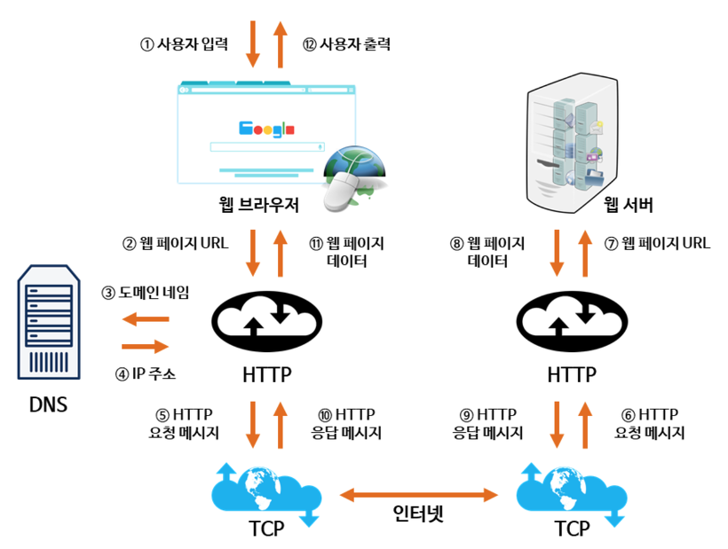

### 6. 웹 통신의 큰 흐름

---

1. 사용자는 웹 브라우저의 주소창에 URL 주소를 입력
2. 입력된 URL은 DNS 서버를 경유, 도메인 주소를 검색하고 매핑되는 IP 주소로 변환
3. IP 주소는 HTTP 프로토콜을 이용해 HTTP 요청 메시지를 생성
4. 생성된 HTTP 요청 메시지는 TCP 프로토콜을 통해 목적지로 전송
5. 서버는 받은 요청을 확인, 검증하고 요청을 처리하여 응답 메시지를 전송
6. HTTP 응답 메시지는 HTTP 프로토콜을 통해 웹페이지 데이터로 변환, 사용자의 화면에 출력

