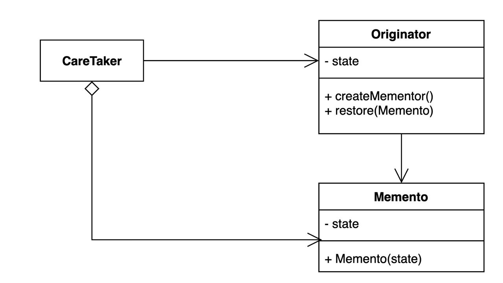

## **메멘토**

---

객체 내부의 세부 사항을 숨기면서 객체의 특정 상태 저장하고 복원할 수 있게 해주는 패턴

- 스냅샷을 생성하고자 할 때 객체들의 중요 데이터들이 숨겨져 있기 때문에 접근이 불가능할 수 있다.
- 중요 데이터에 대한 접근을 풀어놓아도 클래스 리팩토링을 하게 되면 상태를 복사, 복원하는 역할을 하는 클래스도 수정을 해야한다.
- 클래스 세부 정보를 숨기면서 스냅샷을 생성하기 위한 접근을 가능하게 하려면?

**구조**

- Care Taker: Originator의 내부 정보를 가지고 있으며 백업, 복원 기능을 가지고 있음
- Originator: 현재 상태를 저장하거나 다른 상태로 복원하고 싶은 객체
- Memento: Originator의 특정 시점의 내부 정보를 가지고 있는 객체, 스냅샷
- 스냅샷의 생성은 해당 상태의 실제 소유자인 Originator가 담당, 메멘토에게 스냅샷 저장을 제안하고 내용은 메멘토를 생성한 객체를 제외하고는 접근이 불가능



- **구현**

    ```java
    @Getter
    @Setter
    public class Game {
    	private int aScore;
    	private int bScore;
    }
    ```


언제 사용할까

- 자바의 직렬화 역직렬화