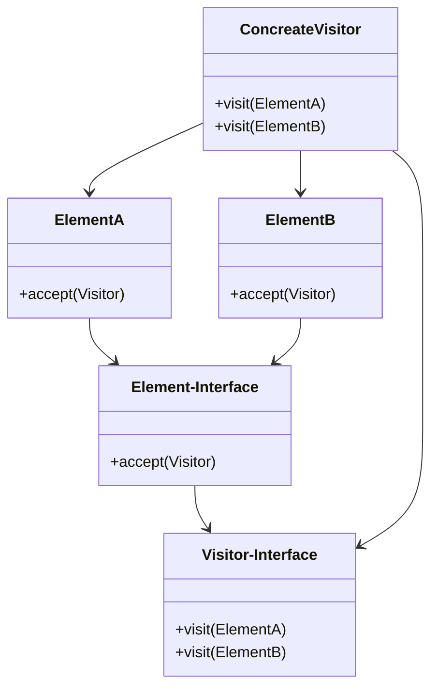

# 디자인 패턴 - 비지터 패턴
## 비지터 패턴이란?
> 기존 코드를 건드리지 않고 새로운 기능을 추가할 때에 사용하는 패턴


- Element: 기존에 존재하는 객제 `변하지 않는 객체`
- Visitor: `추가하고자 하는 기능`을 가지고 있는 객체

비지터패턴을 적용할때는 기존에 존재하는 객체인 Element 에 accept(Visitor)를 가지고 있음
accept(Visitor) 메소드 안에서는 Visitor.visit(this) 로 자기자신을 넘겨줌

## 비지터를 적용하지 않은 코드
Shape라는 인터페이스가 존재 Shape를 구현하는 Rectangle 과 Triangle 가 있음
```java
public interface Shape { }

public class Rectangle implements Shape {
}

public class Triangle implements Shape {
    
}
```
여기서 디바이스에 각각의 Shape를 출력하는 기능을 추가한다면? 그리고 Shape는 디바이스마다 다르게 출력하는 기능이라고 가정

그렇다면 먼저 인터페이스인 Shape에 추상메서드를 추가하고 구현체에 추상메서드를 각각의 구현체에 맞게 구조화 할것임

```java
public interface Shape {
    void printTo(Device device);
}
```
```java
public class Rectangle implements Shape {
    @Override
    void printTo(Device device) {
        if (Device instanceof Phone) {
            System.out.println("print Rectangle to Phone");
        } else if (Device instanceof Watch) {
            System.out.println("print Rectangle to Watch");
        }
    }
}
```
```java
public class Triangle implements Shape {
    @Override
    void printTo(Device device) {
        if (Device instanceof Phone) {
            System.out.println("print Triangle to Phone");
        } else if (Device instanceof Watch) {
            System.out.println("print Triangle to Watch");
        }
    }
}
```
이런식으로 구현 할 수 있음 이러면 다음과 같은 `문제점`이 발생
- Solid Open-Closed principle 위반
- single responsibility principle 위배
  - 디바이스에 출력하는 행동이 Shape 에서 가져야하는 책임인가에 대해 생각해 봤을때
- Shape 와 Device 가 추가될 때마다 코드가 늘어나거나 수정해야됨
- 새로운 Device 가 추가 되었을때 해당 device 에 조건문을 수정하지 않는다면 오류가 발생할 여지가 충분

## 비지터패턴 적용해보기
먼저  Element-Interface 인 Shape 를 리펙토링
```java
public interface Shape {
    void accept(Device device);
}
```

그리고 구현체들에 accept 를 구현
```java
public class Rectangle implements Shape {
    @Override
    public void accept(Device device) {
        device.print(this);
    }
}
```
```java
public class Triangle implements Shape {
    @Override
    public void accept(Device device) {
        device.print(this);
    }
}
```

이렇게 element 를 리펙토링하고 Visitor 인 device 가 아래와 같이 변경

```java
// 각각의 element 를 인자로 받는 추상메서드를 만듬
public interface Device {
    void print(Triangle triangle);

    void print(Rectangle rectangle);
}
```
마지막으로 visitor 를 구현하는 ConcreateVisitor 인 Phone 과 Watch 를 만듬

```java
public class Phone implements Device {
    @Override
    public void print(Triangle triangle) {
        System.out.println("Print Triangle to Phone");
    }

    @Override
    public void print(Ractangle ractangle) {
        System.out.println("Print Rectangle to Phone");
    }
}
```

```java
public class Watch implements Device {
    @Override
    public void print(Triangle triangle) {
        System.out.println("Print Triangle to Watch");
    }

    @Override
    public void print(Ractangle ractangle) {
        System.out.println("Print Rectangle to Watch");
    }
}
```

## 장단점
- 장점
  - 기족 코드를 안변경하고 새로운 기능을 추가가능
- 단점
  - 비지터패턴을 모르면 구조 이해가 빡셈
  - visitor 에 element 를 인자로 가지고있는 메소드를 오버라이딩해야됨
  - 만약 element 가 추가되거나 삭제되면 코드의 변경점이 늘어남

## Reference & Additional Resources
- https://straw961030.tistory.com/363
