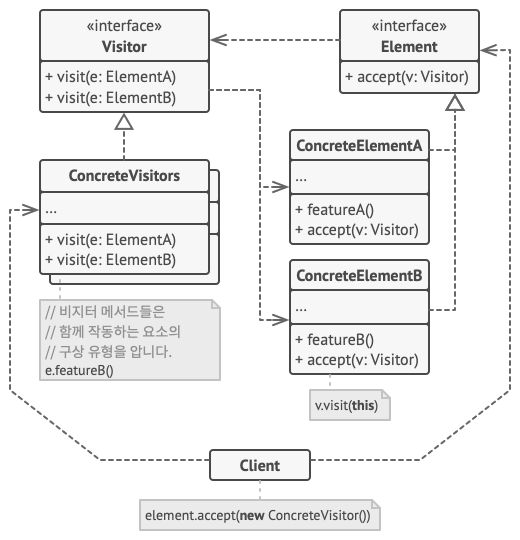

## **비지터**

---

객체의 구조와 수행되는 작업을 분리하여 구현하는 패턴

- 객체에서 수행될 작업은 방문자에게 위임
- 방문자는 각 개체를 순회하면서 객체에서 전달 받은 정보를 토대로 작업을 처리

**구조**

- Visitor: 방문할 방법을 선언, 오버로딩을 지원하는 플랫폼인 경우 메서드 이름은 같을 수 있지만 파라미터는 달라야한다.
- ConcreteVisitors: 각 객체들을 방문할 구체적인 방문 방법을 작성
- Element: 방문자가 방문하게 될 객체들의 인터페이스로 accept 메서드를 공통적으로 가짐
- ConcreteElement: 방문자가 방문하게될 실제 객체, accept 메서드로 방문자를 허용하고 필요한 정보들을 제공



**사용 예시**

- 가격 계산기

    ```java
    // visitor interface
    public interface PriceVisitor {
    	int visit(Food food);
    	int visit(Furniture furniture)
    	int visit(Utensil utensil)
    }
    
    // Element interface + ConcreteElement
    public interface Element {
    	int accept(PriceVisitor visitor);
    }
    
    public class Food implements Element {
    	private int price;
    	
    	public Food(int price) {
    		this.price = price;
    	}
    	
    	public int getPrice() {
    		return price;
    	}
    	
    	@Override
    	public int accept(PriceVisitor visitor) {
    		return visitor.visit(this);
    	}	
    	
    	// 같은 방식으로 Furniture, Utensil 클래스 작성
    }
    
    // ConcreteVisitor
    public class ConcretePriceVisitor implements PriceVisitor {
    	@Override
    	public int visit(Food food) {
    		return food.getPrice();
    	}
    	@Override
    	public int visit(Furniture furniture) {
    		return furniture.getPrice();
    	}
    	@Override
    	public int visit(Utensil utensil) {
    		return utensil.getPrice();
    	}	
    }
    
    // Main
    public class Main {
    	public static void main(String[] args) {
    		Element food = new Food(5000);
    		Element furniture = new Furniture(10000);
    		Element utensil = new Utensil(3000);
    		
    		PriceVisitor visitor = new ConcretePriceVisitor();
    		
    		int total = food.accept(visitor) + furniture.accept(visitor) + utensil.accept(visitor);
    		
    		System.out.println(total);
    	}
    }
    ```


**특징**

- 단일 책임 원칙, 개방 폐쇄 원칙을 준수한다. 기능은 visitor에서 추가하고 수정하면 되기 때문에 Element 클래스를 직접 수정하거나 추가할 필요가 없다.
- 하지만 클래스가 수정되거나 새로운 정보가 추가될 경우 모든 visitor 클래스를 수정해야 하기 때문에 번거로울 수 있다.
- 또 visitor가 element가 소유하고 있는 정보에 필요한 권한을 얻지 못할 수도 있다.
- 복잡한 구조를 가진 element에 전부 작업을 진행해야 하는 경우에 유용하다.