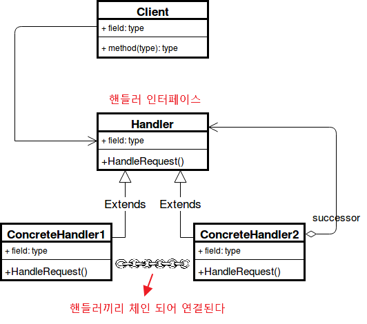

## **역할변경 (책임연쇄)**

---

요청에 대한 처리를 맡는 객체를 여러 개로 두고 사슬처럼 연결하여 집합 안에서 연쇄적으로 처리하는 패턴

- 요청을 처리할 수 있는 객체를 찾을 때까지 집합 안에서 순회
- 특정 행동을 핸들러라는 독립 객체로 두고 요청이 잘 처리될 때까지 다음 핸들러로 요청을 위임

**구조**

- Handler: 모근 핸들러에 대한 인터페이스를 제공
- Concrete Handlers: 다음 핸들러에 대한 참조를 저장하기 위한 필드를 정의하고 자신이 처리 할 수 없을 경우 다음 Concrete Handler로 요청을 전달
- Client: 요청을 받아 Handler로 전달하는 역할

**언제 패턴을 사용하는가**

- 들어오는 요청을 다수의 객체에서 판별하고 처리해야 할 때
- 요청을 특정 순서대로 처리해야 하는 경우
- 들어오는 요청이 다양한 것을 알고 있지만 정확한 유형, 처리 방식, 순서 등이 확실하지 않을 때

**특징**

- 클라이언트는 핸들러 객체 집합, 집합 내부의 구조를 신경 쓰지 않아도 된다.
- 객체마다 해야 하는 일을 구분하고 있으며 독립적이기 때문에 새로운 처리 방식의 추가가 간편하다.
- 코드 변경 없이도 요청의 처리 순서, 핸들러의 추가와 삭제가 용이하여 유연성이 높다.
- 하지만 핸들러가 많아질수록 흐름에 대한 이해가 어려워지고 디버깅, 테스트 과정이 어려워진다.
- 설계, 테스트, 디버깅을 명확하게 하지 못하면 무한 사이클이 발생할 수 있으며 최종 핸들러에서도 요청이 처리 되지 못하는 경우가 발생할 수 있다.
- 핸들러가 많을 수록 요청의 전달이 많아지면서 처리가 지연될 수 있어 명확한 패턴 적용 타이밍을 숙지해야한다.
