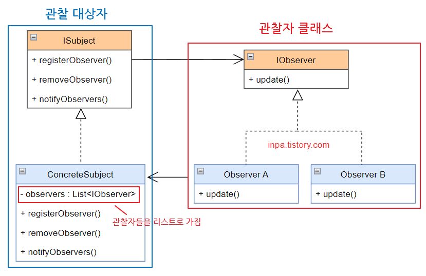

## 옵저버 패턴

---

관측자를 두고 변화가 있을 경우 등록된 객체(subscriber)들에게 통지하는 패턴

- 변경 사항을 확인하기 위해 객체가 변경 사항이 생길 때마다 확인하거나, 변경 사항이 생길 때마다 모든 객체에 스팸 메일을 보내듯이 통지하는 과정은 불필요한 리소스를 낭비하게 된다.
- 구독자 리스트를 두고 이것을 참조하여 알림을 보내면 효율적

**구조**

- ISubject: 관찰 대상자를 정의
- ConcreteSubject: 관찰 대상자, 구독자들을 정의
    - List로 구독자들을 저장, 추가로 구독자를 등록하거나 삭제하는 기능을 탑재
    - 관찰 대상자의 상태가 변경되거나 동작이 실행되면 이를 관찰자들에게 알림
- IObserver: 구독자들 인터페이스
- Observer: 구독자들을 구체화
    - 알림을 받으면 이에 대한 정보를 처리
- 관찰자들은 언제나 구독 리스트에서 삭제, 추가될 수 있다.

**흐름**

1. 1개의 관찰 대상자와 여러 관찰자들로 구성됨
2. 관찰 대상자의 상태가 변경되면 관찰자들에게 변경사항을 알림
3. 관찰자들은 변경 사항에 대해 필요한 조치를 취함

**사용**

- 특정 개체의 상태 변화 시 다른 객체가 동작해야 하는 경우
- 어떤 객체들이 특정 동작 시 변화해야 하지만 모두 인지하고 있을 필요는 없거나 그 수가 많을 때
- MVC 패턴
    - Model 과 View
    - 모델이 변화하면 동시에 그것을 보여주는 view들이 전부 변화해야 함

**장단점**

- 주기적 조회 없이 변화가 발생하면 자동으로 감지하고 행동
- 코드 변경 없이도 새로운 구독자 클래스를 생성할 수 있다.
- 재사용성이 좋다.
- 알림 순서를 조작해 운선순위를 둘 수 없다
- 자주 사용할 경우 구조와 동작을 알아보기 힘들어지며 등록 후 해지하지 않으면 메모리 누수가 생길 수 잇다.