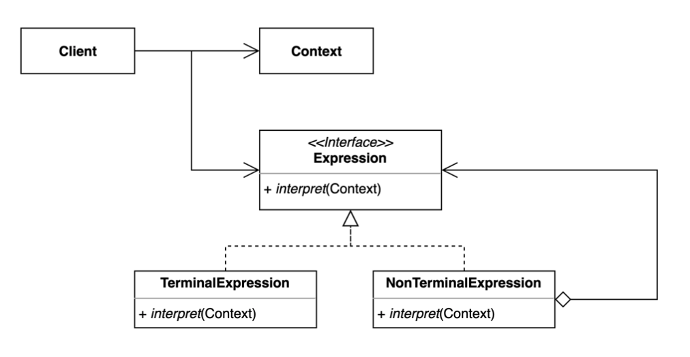

## **인터프리터**

---

자주 사용되는 문법이나 규칙이 있다면 이것을 규격화하여 재사용하는 패턴, 정규표현식을 예시로 볼 수 있다.

**구조**

- Context: 문법, 패턴(Expression) 에서 사용하는 공통적인 정보가 담김
- Expression: 표현할 규칙을 정의하는 부분
- TerminalExpression: 종점 결과물, 더 이상 규칙을 통해 변환될 수 없음
- NonTerminalExpression: 규칙 트리를 타고 추가적인 결과값을 낼 수 있는 경우
- 전체적인 구조는 트리 구조, NonTerminalExpression에서 TerminalExpression과 NonTerminalExpression이 트리 형식으로 쭉 이어지게 된다.



**사용 예시**

- 2+3*4 수식에 인터프리터 패턴을 적용한다고 했을때

    ```java
    // Abstract Expression
    interface Expression {
        int interpret(Context context);
    }
    // Terminal Expressions
    class NumberExpression implements Expression {
        private int number;
        public NumberExpression(int number) {
            this.number = number;
        }
        @Override
        public int interpret(Context context) {
            return number;
        }
    }
    class AddExpression implements Expression {
        private Expression leftExpression;
        private Expression rightExpression;
        public AddExpression(Expression leftExpression, Expression rightExpression) {
            this.leftExpression = leftExpression;
            this.rightExpression = rightExpression;
        }
        @Override
        public int interpret(Context context) {
            return leftExpression.interpret(context) + rightExpression.interpret(context);
        }
    }
    // Context
    class Context {
        // Additional context information, if needed
    }
    // Client
    public class Application {
        public static void main(String[] args) {
            // Create the expression: (2 + 3) + 4
            Expression expression = new AddExpression(
                    new AddExpression(new NumberExpression(2), new NumberExpression(3)),
                    new NumberExpression(4)
            );
            // Create the context, if needed
            Context context = new Context();
            // Interpret the expression
            int result = expression.interpret(context);
            System.out.println("Result: " + result); // Output: Result: 9
        }
    }
    
    // 출처: https://medium.com/@rajeshvelmani/understanding-language-interpretation-with-the-interpreter-design-pattern-in-java-b2a3969eaf9
    ```

- 다른 방식

    ```java
    public class Client {
        public static void main(String[] args) {
            // Input expression
            String expression = "2 + 3 * 4";
             
            // Create interpreter
            Context context = new Context();
            Interpreter interpreter = new Interpreter(context);
             
            // Interpret expression
            int result = interpreter.interpret(expression);
            System.out.println("Result: " + result);
        }
    }
    
    public class Context {
        // Any global information needed for interpretation
    }
    
    public interface Expression {
        int interpret(Context context);
    }
    
    class Interpreter {
        private Context context;
     
        public Interpreter(Context context) {
            this.context = context;
        }
     
        public int interpret(String expression) {
            // Parse expression and create expression tree
            Expression expressionTree = buildExpressionTree(expression);
             
            // Interpret expression tree
            return expressionTree.interpret(context);
        }
     
        private Expression buildExpressionTree(String expression) {
            // Logic to parse expression and create expression tree
            // For simplicity, assume the expression is already parsed
            // and represented as an expression tree
            return new AdditionExpression(
                new NumberExpression(2),
                new MultiplicationExpression(
                    new NumberExpression(3),
                    new NumberExpression(4)
                )
            );
        }
    }
    
    // Terminal Expression
    public class NumberExpression implements Expression {
        private int number;
     
        public NumberExpression(int number) {
            this.number = number;
        }
     
        @Override
        public int interpret(Context context) {
            return number;
        }
    }
    
    // non-terminal Expression
    public class AdditionExpression implements Expression {
        private Expression left;
        private Expression right;
     
        public AdditionExpression(Expression left, Expression right) {
            this.left = left;
            this.right = right;
        }
     
        @Override
        public int interpret(Context context) {
            return left.interpret(context) + right.interpret(context);
        }
    }
     
    public class MultiplicationExpression implements Expression {
        private Expression left;
        private Expression right;
     
        public MultiplicationExpression(Expression left, Expression right) {
            this.left = left;
            this.right = right;
        }
     
        @Override
        public int interpret(Context context) {
            return left.interpret(context) * right.interpret(context);
        }
    }
    
    // 출처: https://www.geeksforgeeks.org/interpreter-design-pattern/
    ```


**특징**

- 자주 사용하는 문법, 규칙 등을 언어로 정의하여 재사용이 가능하다.
- 새로운 규칙 추가 시 기존 코드의 수정 없이 가능하다.
- 인터프리터의 크기가 커질 수록 , 작성하는 규칙이 복잡해질수록 클래스의 개수가 많아지며 Expression과 Parser도 복잡해진다.
- 내장 기능만으로도 충분히 해결히 가능한 간단한 서비스일 경우, 성능이 높은 우선순위로 잡혀 있는 경우 불필요하게 복잡도를 증가시키고 오버헤드를 발생 시킬 가능성이 있으므로 사용하지 않는게 좋다.