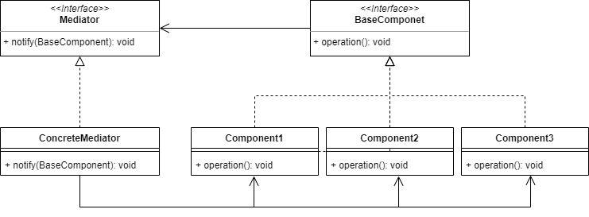
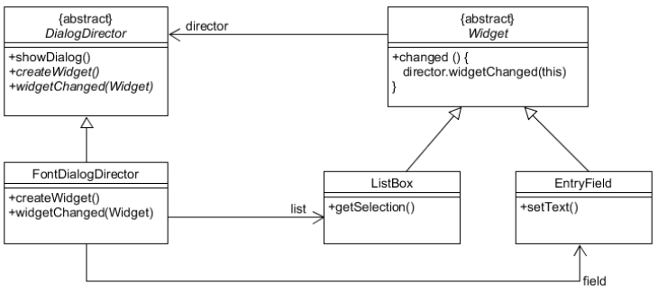

## 중재자 패턴

---

객체 간의 의존 관계를 약하게 하기 위한 패턴으로 객체 간의 직접적인 통신을 제한하고 중재자를 통해서만 통신이 가능하게 하는 패턴

- 서로 직접적으로 통신을 위해 얽히면서 의존관계가 복잡하게 얽히는 것을 방지
- 하나의 중재자를 통해서 통신을 하게 하여 의존관계, 상호작용을 간편하게 할 수 있음

**구조**

- Mediator: BaseComponent와 통신하기 위한 인터페이스를 제공
- ConcreteMediator: Mediator를 구현
- BaseComponent: Component가 Mediator를 통해 통신할 수 있는 인터페이스를 제공
    - Component들은 중재자의 실제 클래스를 인식하지 못하기 때문에 다른 중재자를 연결하여도 동작이 가능
- Component: BaseComponent의 구현체
    - Component 간에는 서로의 존재를 모르고 있어야 하며 문제 상황이나 요청은 모두 중재자를 통해야 한다.

**예시**

- 문서 작성 프로그램에서 폰트가 변경된 경우
    - 폰트 창에서 변경됨을 중재자에게 알림
    - 중재자는 어떤 사항이 변경된 것인지를 요청하여 받아오고
    - 변경된 사항을 입력 창에 알림

**특징**

- 클래스 간에 의존도가 높아 수정이나 기능 추가 시 애로사항이 있을 때 사용하는 것이 좋다.
- M:N 관계를 중재자를 통해 M:1 관계로 바꿀 수 있으며 전체적인 연결 관계 파악에 용이하다.
- 퍼사드 패턴, 옵저버 패턴과 다르게 양방향 통신이 가능, subscriber가 publisher가 될 수도 있음
- 각각의 클래스는 재사용이 중재자를 통해서만 느슨한 연결을 구성하기 때문에 재사용이 가능하다.
- 하지만 중재자에 너무 많은 책임을 줄 경우 SRP를 위배하게 되며 신 객체로 변화할 수 있으므로 주의해야 한다.