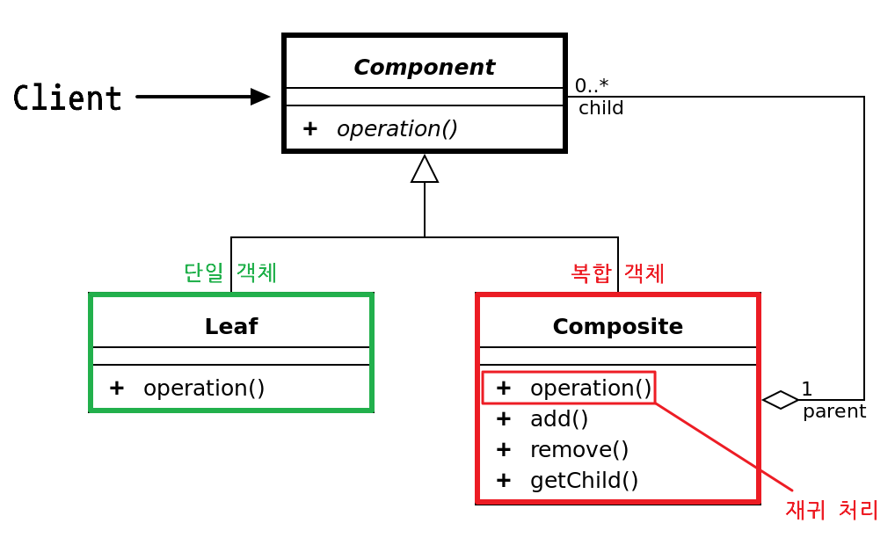

## **컴포지트**

---

사용자가 단일 객체, 복합 객체를 동일하게 취급할 수 있도록 하는 패턴

- 폴더 안에 폴더, 폴더 안에 파일과 같이 복잡한 계층 구조를 신경쓰지 않고 하위 객체들에게 작업을 위임
- 재귀적 특성을 가지며 단일 객체, 복합 객체 관계없이 같은 작업을 적용할 수 있게 된다.

**구조**

- Component: 인터페이스, 트리가 수행할 공통 작업을 정의
- Leaf: 하위 요소가 없는 트리의 기본 요소, Composite가 필요한  값을 반환
- Composite
    - 하위 요소들을 가지고 있는 복합 객체, 요청을 하위에 전달하거나 직접 값을 반환
    - 구현체들을 내부 리스트로 가지고 있으며 삭제, 추가를 할 수 있다.
    - 재귀를 통해 하위 단일 객체, 복합 객체를 순회


예시

```java
interface Component {
	void operation();
}

class Leaf implements Component {
	
	@Override
	public void opertation() {
		System.out.println(this + " leaf 호출");
	}
}

class Composite implements Component {
	
	List<Component> components = new ArrayList<>();
	
	public void add(Component c) {
		components.add(c);
	}
	
	public void remove(Component c) {
		components.remove(c);
	}
	
	@Override
	public void opertation() {
		System.out.println(this + " Composite 호출");
		
		for(Component c : components) {
			c.operation();
		}
	}
	
	public List<Component> getChilds() {
		return components;
	}
}
```

**특징**

- 파일 구조와 같이 계층적 트리 표현을 다룰 때, 단일체와 복합체 동일한 관리가 필요할 때 유용
- 수평, 수직적으로 확장이 가능하다.
- 재귀 특성 상 깊이가 깊어질수록 문제가 발생한 부분을 찾기 어렵다.
- 범용성이 굉장히 크기 때문에 필요에 따른 제약을 추가하기 어려우며 leaf, composite가 동일한 인터페이스를 가지도록 설계하는 것이 어려울 수 있다.