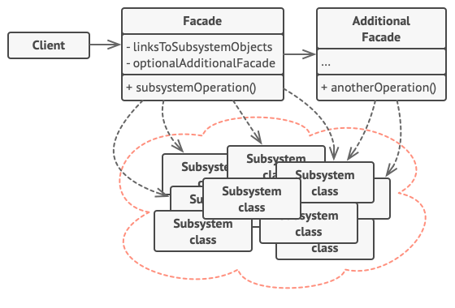

## **퍼사드**

---

사용하기 복잡한 클래스 라이브러리를 간편한 인터페이스로 재구성한 구조 패턴

- 버전이 높아질수록 많아지는 클래스를 다시 재정리하는 것

**구조**

- Facade: 복잡한 로직을 재정리한 클래스
- Additional Facade: 연관되지 않는 기능이 있을 경우 추가로 만들 수 있는 퍼사드
- 클라이언트는 서브시스템을 직접 사용하지 않고 Facade를 통해 간편하게 서비스를 사용할 수 있다.


- **사용 예시**

    ```java
    @Service
    @RequiredArgsConstructor
    public class UserServiceFacade {
    
        private final TokenService tokenService;
        private final UserService userService;
        private final TokenProvider tokenProvider;
    
        @Transactional
        public JwtTokenDto getJwtTokenDto(String refreshToken) {
    
            Users foundUser = userService.findUserById(tokenService.validate(refreshToken));
    
            return tokenProvider.createNewAccessToken(foundUser, foundUser.getRoles());
        }
    
        @Transactional
        public String logoutUser(Long userId) {
    
            return tokenService.deleteRefreshByUserId(userId);
        }
    
        @Transactional
        public String deleteUser(Long id) {
    
            try {
                tokenService.deleteRefreshByUserId(id);
                return userService.deleteUser(id);
            } catch (Exception e) {
                throw new CustomException(ErrorCode.USER_NOT_FOUND);
            }
        }
    }
    
    // Controller
    @Slf4j
    @RestController
    @RequestMapping("/api")
    @RequiredArgsConstructor
    public class UserController {
    
        private final UserService userService;
        // private final TokenService tokenService;
        // private final UserService userService;
        // private final TokenProvider tokenProvider;
        private final UserServiceFacade userServiceFacade;
    ```


**특징**

- 시스템이 복잡하고 외부와 결합도가 너무 높다고 판단될 때 유용
- 하위 시스템을 분리하여 코드 사용성을 높이고 의존성을 낮출 수 있다.
- 퍼사드에 너무 몰리면 god 객체로 변할 수 있으며 퍼사드 클래스 자체의 의존성이 높아질 수 있다.